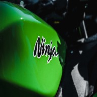
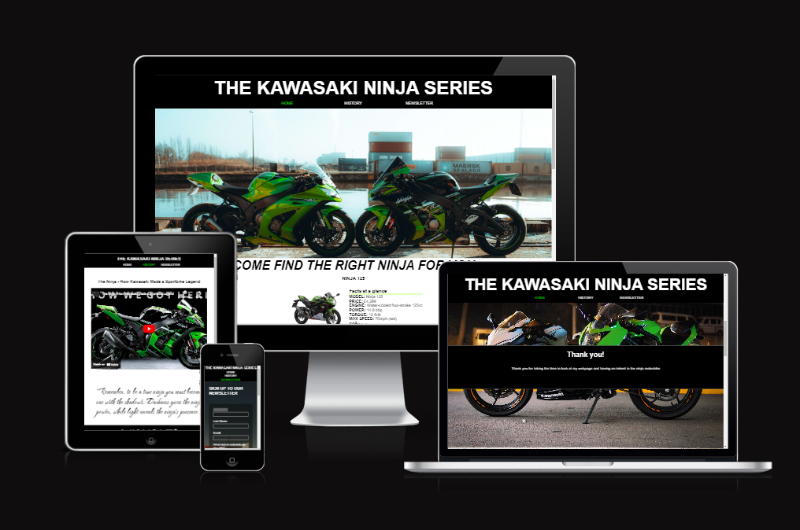
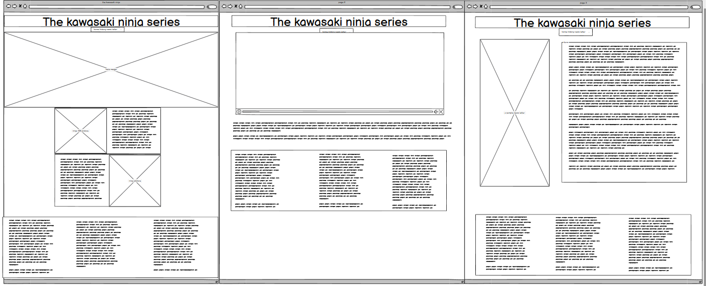
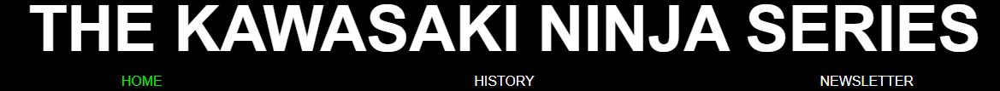
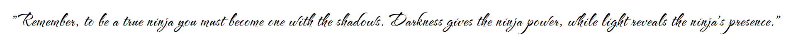
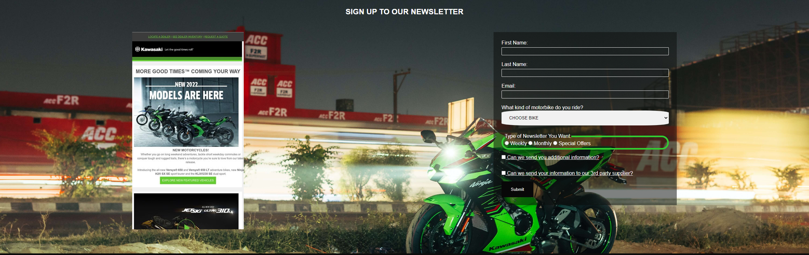
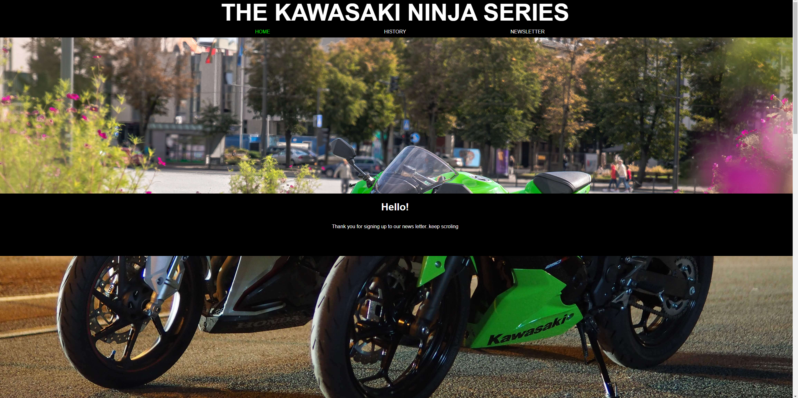

# The Kawasaki Ninja
---
## A site dedicated to teaching the user all about the different ninja bikes, The history of the Ninja, and a newsletter to keep up to date.
 ### It can be viewed on multiple devices and is fully responsive -here have a look


## You can take a closer look here on the live site here -[THE KAWASAKI NINJA](https://benjamin-riordan.github.io/PP1_Kawazaki_NINJA/)

        

---
---
# CONTENTS


* [USER EXPERIENCE](#USEREXPERIENCE)
    * [Initial Discussion](#InitialDiscussion)
    * [User Stories](#UserStories)
* [Design](#Design)
	* [Colour Scheme](#ColourScheme)
	* [Typography](#Typography)
	* [Imagery](#Imagery)
	* [Wireframes](#Wireframes)
* [Features](#Features)
* [Technolgy used ](#Technolgyused)
* [Testing](#Testing)
	* [Code valadation ](#Codevaladation)
	* [Issues I ran into ](#IssuesIraninto)
	* [Code reviews ](#Codereviews)
	* [Major changes during development](#Majorchnagesduringdevelopment)
	* [Lighthouse](#Lighthouse)
		* [Landing page](#Landingpage)
		* [History Page](#HistoryPage)
		* [Newsletter](#Newsletter)
		* [Thank you page](#Thankyoupage)
	* [Links](#Links)
    * [Deployment](#Deployment)
* [Crediations and citataions](#Crediationsandcitataions)
	* [Images ](#Images)
	* [Video](#Video)
	* [Code used ](#Codeused)
* [Acknowledgments](#Acknowledgments)
* [Thank you !](#Thankyou!)

    

___

# USER EXPERIENCE

## Initial Discussion
The initial discussion for the website involved identifying the target audience and their needs. It was decided that the website would target individuals who are interested in purchasing a Kawasaki NINJA motorcycle or learning more about the bike.

## User Stories
Based on the target audience and their needs, the following user stories were identified:

* As a user, I want to learn about the different models of the Kawasaki NINJA so that I can choose the right bike for me.

* As a user, I want to be able to view images and specifications for each model of the Kawasaki NINJA so that I can make an informed 
decision.

* As a user I would like to learn about the history of the ninja motorbike

* As a user, I want to be able to contact the website's owner if I have any questions or concerns.

## Design
 ### Colour Scheme
The website uses a black and green colour scheme, which is consistent with the branding of the Kawasaki NINJA.


## Typography
The website uses a sans-serif font for headings and a serif font for body text, which provides a clean and professional look. this is also very close to the actual 5kawasaki font on their webpage

## Imagery
The website uses high-quality images of the different models of the Kawasaki NINJA -you can see where I got the images from here----add in link to image sources here

## Wireframes
Wireframes were created to plan the layout and design of the website. The wireframes were used to guide the development process and ensure that the website met the needs of the target audience.

## Features
The website has four main pages, each with its own features three that are shown in the nav bar and one that is a thank you page for filling out the form.

1. Home/landing page

The Home/landing page is the first introduction it has a large hero image

gives a brief guide on what to do using font awesome arrows and text

there is also bike information  section with links,

 each of these sections links externally to a site about that particular bike using target  _blank
 it also has a nav bar and a footer NOTE:these are across all pages


2. History page

This page again carries the same header and footer as the home page and mostly consists of a youtube video and a quote, the youtube video has all the controls needed for the user to control the video, and auto play is turned off.

3. Newsletter/sign-up page

The Newsletter/sign-up page contains a background image and a sample newsletter next to a signup form 

The form has all attributes set to required and submitting the form brings you to thank you page

``` HTML 
<div class="sign-up-form-form">
                 <form action="thank_you.html" method="get" class="form-style">
                     <label for="first-name">First Name:</label>
                     <input class="form-text" type="text" id="first-name" name="first-name" required>

                     <label for="last-name">Last Name:</label>
                     <input class="form-text" type="text" id="last-name" name="last-name" required>

                     <label for="email">Email:</label>
                     <input class="form-text" type="email" id="email" name="email" required>
                     <label for="motorbike">What kind of motorbike do you ride?</label>
                     <select id="motorbike" name="motorbike" required>
                         <option value="">choose bike</option>
                         <option value="kawasaki">kawasaki</option>
                         <option value="suzuki">Suzuki</option>
                         <option value="honda">Honda</option>
                         <option value="yamaha">Yamaha</option>
                     </select>

                     <fieldset>
                         <legend>Type of Newsletter You Want:</legend>
                         <label><input type="radio" name="newsletter" value="weekly" required> Weekly</label>
                         <label><input type="radio" name="newsletter" value="monthly" required> Monthly</label>
                         <label><input type="radio" name="newsletter" value="special-offers" required> Special
                             Offers</label>
                     </fieldset>

                     <label class="add-info"><input type="checkbox" name="additional-info" value="yes"> Can we send you
                         additional information?</label>
                     <br>
                     <label class="add-info"><input type="checkbox" name="third-party" value="yes"> Can we send your
                         information
                         to our 3rd party supplier?</label>
                     <br>

                     <input class="submit-btn" type="submit" value="Submit">
                     </form>
                     
```

4. Thank you page

The Thank you page has a parallax effect and contains some information and a thank you note for all the people that submitted the form

5. future implementations 

    * I would like to add a section where you can see the most trending bike at the moment.

    * I would like to add a section where a user can upload an image of their bike and add custom features to it.

    * I would like to add an accessories page and a payment system to buy merchandise

6. Accessibility
    I wanted to create a website that everybody could use so, therefore, I used :

HTML that has a proper structure 

Alt attributes on all images except for background images on the site.

Any area that had an issue I added in aria labels

Using [WAVE](https://wave.webaim.org/) to make sure that the site has a good contrasting color


_____________________________
__________________________
_____________________________

## Technolgy used 

* Languages
    * HTML
    * CSS
    * JAVASCRIPT (for font awesome)

* Git and Github And Gitpod.
were used for writing, saving, and publishing my code and for version control.

* [Balsamiq](https://balsamiq.com/wireframes/?gclid=EAIaIQobChMIsp6W8N2G_gIV2-7tCh3nTQ4BEAAYAiAAEgLOuPD_BwE) - Used to create wireframes.
* [Google Fonts](https://fonts.google.com/) - To import the fonts used on the website.
* [Font Awesome](https://fontawesome.com/) - For the iconography on the website.
* [Google Dev Tools](https://developer.chrome.com/docs/devtools/) - To troubleshoot and test features, and solve issues with responsiveness and styling.
* [Tiny PNG](https://tinypng.com/) To compress images.
* [Favicon.io](https://favicon.io/) To create favicon.
* [Am I Responsive?](https://ui.dev/amiresponsive) To show the website image on a range of devices.
* [Shields.io](https://shields.io/) To add badges to the README
* [Remove.bg](https://www.remove.bg/) to remove background from images


---
# Testing

Throughout the build process i used google dev tools to always check how responsive my page was, and how any change would look

My process was as follows -

1. Add in HTML, push to the site(local) , and check.if all is okay i moved to CSS if not I went back and fixed 
2. Add in CSS, push to the site(local), and check if it's not what I intended I would use dev tools to change it and then reflect that back in my code

3. Now I would push to the live site and re-check, and again if I had any issues, go back and fix them.


## Code validation 

<p>
    <a href="http://jigsaw.w3.org/css-validator/check/referer">
        
    </a>
</p>

all the HTML has passed as well,I can't find the image for it.


## Issues I ran into 

1. Incorrect file paths, were my main issues during the development of this site, but a quick google helped to slove that.

2. images file sizes were too large and were making my performance drop in the lighthouse test, i corrected this but using TINY png and re-uploading all the files


3. getting the image to be responsive 

``` css
.hero_image_outer {
    width: 100%;
    height: 600px;
    overflow: hidden;
    position: relative;
}

.hero_image_inner {
    height: 600px;
    width: 100%;
    background: url....
}
```
  ``` css
.hero_image_outer {
 width: 100%;
    height: 100%;
    overflow: hidden;}
.hero_image_inner {
    height: 100%;    /* this was my fix and the main issue */
    width: 100%;
    background: url....}

```
    
-----------------------------------------------------------

 4. Nav bar issues  

I had an issue where the outermost point of my nav bar on the left-hand side didn't fill the whole bar 
reasons 

code issues 

none that i could spot,


resolution
I asked in slack for assistance and was told to look at box-sizing- border-box  and to make my elements have a width of 33.33% instead of 33%
and to make the border be contained inside the sizing using the above 

--------problem code---------
``` css
/* overall removal of margins, padding and border */

 {

margin: 0px;

padding: 0px;

border: 0px;

    
}

.nav_layout li {

width: 33%;

float: left;

list-style: none;

text-align: center;

padding-top: 2px;

border-left: 1px solid grey;

line-height: 20px;

}

```

----solution code---
```css
/* overall removal of margins, padding and border */
 {
margin: 0px;

padding: 0px;

border: 0px;

box-sizing: border-box;

}

.nav_layout li {

width: 33.33%;

float: left;

list-style: none;

text-align: center;

padding-top: 2px;

border-left: 1px solid grey;

line-height: 20px;

}

```

## Code reviews 

I submitted a few code reviews and got amazing feedback that I implemented to improve overall site

## Major changes during development

for the start of my project I was using green and white text which turns out is a contrast issue, so I switch back to white on black for better contrast

## Lighthouse 

Using dev tools in google chrome on an incognito page I ran lighthouse on each page, 

here are the results

1. ### Landing page


2. ### History Page


3. ### Newsletter


 4. ### Thank you page 
 


## Links

All the links are set to TARGET_BLANK 

links work as Intended

Phone and mail to links are still causing issues on ios devices, I have looked into this issue and I can't find the issues


## Deployment
First, you need to have a GitHub account and a repo where your website code is stored. 

Next, you need to choose a hosting service to deploy your website. we'll use GitHub Pages, which is a free hosting service provided by GitHub.

Go to your repository's settings and scroll down to the "GitHub Pages" section. Choose the branch you want to use for deployment (usually the main or master branch) and the root directory of your website.

Once you've selected your branch and root directory, click "Save" to deploy your website. GitHub will generate a URL where your website will be hosted (usually in the format username.github.io/repository-name).

Finally, check that your website is deployed and accessible by visiting the URL generated by GitHub. You can make changes to your website code and push them to your repository, and GitHub Pages will automatically update your deployed website.


# Crediations and citataions

## Images 

* the majority of my images were taken from google or Unsplash 

    * Photo by <a href="https://unsplash.com/@nevergg?utm_source=unsplash&utm_medium=referral&utm_content=creditCopyText">力力摄影日记</a> on <a href="https://unsplash.com/s/photos/kawasaki?utm_source=unsplash&utm_medium=referral&utm_content=creditCopyText">Unsplash</a>ninja 400 green 
  


    * Photo by <a href="https://unsplash.com/@andyluismdo96?utm_source=unsplash&utm_medium=referral&utm_content=creditCopyText">Andy Montes de Oca</a> on <a href="https://unsplash.com/s/photos/kawasaki?utm_source=unsplash&utm_medium=referral&utm_content=creditCopyText">Unsplash</a> ninja black


    * Photo by <a href="https://unsplash.com/@pokmer?utm_source=unsplash&utm_medium=referral&utm_content=creditCopyText">Jingming Pan</a> on <a href="https://unsplash.com/s/photos/kawasaki?utm_source=unsplash&utm_medium=referral&utm_content=creditCopyText">Unsplash</a>man in tshirt on balck ninja


    * Photo by <a href="https://unsplash.com/@masakaze?utm_source=unsplash&utm_medium=referral&utm_content=creditCopyText">Masakaze Kawakami</a> on <a href="https://unsplash.com/s/photos/kawasaki?utm_source=unsplash&utm_medium=referral&utm_content=creditCopyText">Unsplash</a>
  white and green ninja


    * Photo by <a href="https://unsplash.com/es/@timaesthetic?utm_source=unsplash&utm_medium=referral&utm_content=creditCopyText">Tim Rüßmann</a> on <a href="https://unsplash.com/s/photos/kawasaki-ninja?orientation=landscape&utm_source=unsplash&utm_medium=referral&utm_content=creditCopyText">Unsplash</a>


    * Photo by Hasan Gulec: https://www.pexels.com/photo/green-motorbikes-parked-near-water-11059022/


    * Photo by Sourav Mishra: https://www.pexels.com/photo/city-road-street-car-15170432/  


* I used a bg removal tool for the main content images

## Video


Yammie Noob
1.19M subscribers
https://www.youtube.com/watch?v=1IFt4o3Azdg


## Code used 

 The oustside code i used was the parallax code and i took that from W3 schools and then customized it
 and font-awesome for footer icons and main cont cions

## Content 
 The content is from google and the kawasaki webpage

## Acknowledgments
I would like to thank my mentor(okwudiri_mentor
)  , my class and alan my cohort facilatator for help with this project along with a few extra people Tom(
Tom_Alumnus_Lead) and Daisy (Daisy_mentor)


# Thank you !