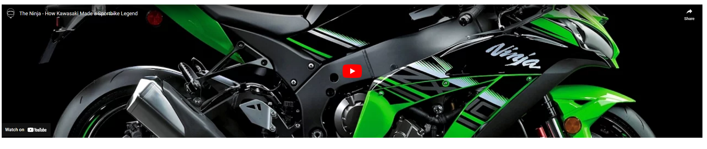

# The kawasaki Ninja
---
## A site dedicated to teaching the user all about the difffrent ninja bikes ,The history of the Ninja and a newsletter to keep up to date.
 ### It can be viewed on multiple divces and is fully responsive -here have a look 


## You can take a closer look here on the live site here -[THE KAWASAKI NINJA](https://benjamin-riordan.github.io/PP1_Kawazaki_NINJA/)

        

---
---
## CONTENTS

___
## USER EXPEIRENCE

### Initial Discussion
The initial discussion for the website involved identifying the target audience and their needs. It was decided that the website would target individuals who are interested in purchasing a Kawasaki NINJA motorcycle or learning more about the bike.

### User Stories
Based on the target audience and their needs, the following user stories were identified:

* As a user, I want to learn about the different models of the Kawasaki NINJA so that I can choose the right bike for me.

* As a user, I want to be able to view images and specifications for each model of the Kawasaki NINJA so that I can make an informed 
decision.

* As a user i would like to learn about the history of the ninja motorbike

* As a user, I want to be able to contact the website's owner if I have any questions or concerns.

### Design
Colour Scheme
The website uses a black and green colour scheme, which is consistent with the branding of the Kawasaki NINJA.


### Typography
The website uses a sans-serif font for headings and a serif font for body text, which provides a clean and professional look. this is also very close to the actual 5kawasaki font on thier webpage

### Imagery
The website uses high-quality images of the different models of the Kawasaki NINJA -ypu can see where i got the images fromm here----add in link to image sources here

### Wireframes
Wireframes were created to plan the layout and design of the website. The wireframes were used to guide the development process and ensure that the website met the needs of the target audience.

### Features
The website has four main pages, each with its own features three that are show in the nav bar and one that is a thank you page for filling out the from.

1. Home/landing page

The Home/landing page is the first introduction it has a large hero image 

gives a brief guide of what to do using font awesome arrows and text

there is also bike information  section with links,

 each of these sections links exteranly to a site about that particualr bike using target  _blank
 it also has a nav bar and a footer NOTE :these are across all pages


2. History page

This page again carries the same header and footer as the home page and mostly consits of a youtube video and a quote, the youtube video has all the controls needed fro the user to control the video and auto play is tured off.

3. Newsletter/sign-up page

The Newsletter/sign-up page contains a backgrpund image and a sample news letter next to a sign up form 

The form has all atributes set to required and submitting the form brings you to thank you page

``` html 
<div class="sign-up-form-form">
                 <form action="thank_you.html" method="get" class="form-style">
                     <label for="first-name">First Name:</label>
                     <input class="form-text" type="text" id="first-name" name="first-name" required>

                     <label for="last-name">Last Name:</label>
                     <input class="form-text" type="text" id="last-name" name="last-name" required>

                     <label for="email">Email:</label>
                     <input class="form-text" type="email" id="email" name="email" required>
                     <label for="motorbike">What kind of motorbike do you ride?</label>
                     <select id="motorbike" name="motorbike" required>
                         <option value="">choose bike</option>
                         <option value="kawasaki">kawasaki</option>
                         <option value="suzuki">Suzuki</option>
                         <option value="honda">Honda</option>
                         <option value="yamaha">Yamaha</option>
                     </select>

                     <fieldset>
                         <legend>Type of Newsletter You Want:</legend>
                         <label><input type="radio" name="newsletter" value="weekly" required> Weekly</label>
                         <label><input type="radio" name="newsletter" value="monthly" required> Monthly</label>
                         <label><input type="radio" name="newsletter" value="special-offers" required> Special
                             Offers</label>
                     </fieldset>

                     <label class="add-info"><input type="checkbox" name="additional-info" value="yes"> Can we send you
                         additional information?</label>
                     <br>
                     <label class="add-info"><input type="checkbox" name="third-party" value="yes"> Can we send your
                         information
                         to our 3rd party supplier?</label>
                     <br>

                     <input class="submit-btn" type="submit" value="Submit">
                     </form>
                     
```

4. Thank you page

The Thank you page has has a parallax effect and contains some information and a thnk you note for all the people that submitted the form

5. future implemtations 

* I would like add a section where you can see the most trending bike at the moment.

* i would like to add a section where a user can upload an image of thier bike and add custome features to it.

* i would like to add an accesories page and a payment system to buy merchandise

6. Accessibility
    i wanted to create a website that everybody could use so therefore i used :

HTML that has a proper structure 

Alt attributes on  all images except for background images on the site.

Any area that had an issue i added in aria lables

Using [WAVE](https://wave.webaim.org/). to make sure that the site has a good contrasting color


_____________________________
__________________________
_____________________________

## Technolgy used 

* Langauges
    * HTML
    * CSS
    * JAVASCRPIT (for font awesome)

* Git and Github And Gitpod.
were used for writing , saving, and pulbshing my code and for version control.

* [Balsamiq]{https://balsamiq.com/wireframes/?gclid=EAIaIQobChMIsp6W8N2G_gIV2-7tCh3nTQ4BEAAYAiAAEgLOuPD_BwE} - Used to create wireframes.
* [Google Fonts](https://fonts.google.com/) - To import the fonts used on the website.
* [Font Awesome](https://fontawesome.com/) - For the iconography on the website.
* [Google Dev Tools](https://developer.chrome.com/docs/devtools/) - To troubleshoot and test features, solve issues with responsiveness and styling.
* [Tiny PNG](https://tinypng.com/) To compress images.
* [Favicon.io](https://favicon.io/) To create favicon.
* [Am I Responsive?](https://ui.dev/amiresponsive) To show the website image on a range of devices.
* [Shields.io](https://shields.io/) To add badges to the README


---